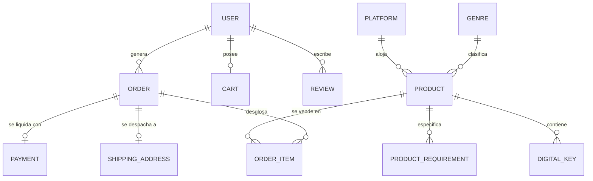
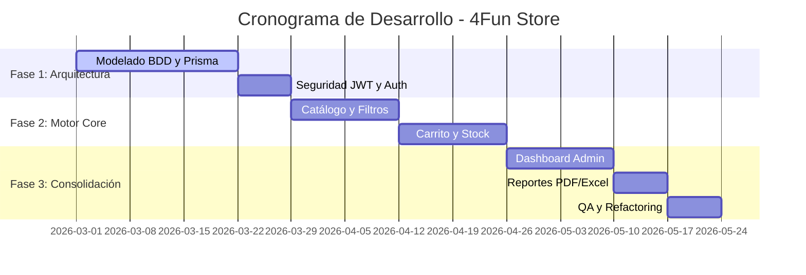

Tecnicatura Universitaria en Programación (TUP)

**Sistema de Gestión E-Commerce 4Fun Store**  
Plataforma modular para la comercialización de videojuegos digitales y físicos

**Integrantes del Grupo:**  
Martínez Enrique Leonel  
Martínez Mariano Agustín

**Tutor/a académico/a:**  
María Eugenia Nuñez

**Institución Vinculante:**  
Universidad Tecnológica Nacional \- Facultad Regional Tucumán

Fecha de presentación: \[Insertar fecha\]  
Año 2026 \- Tucumán, Argentina

# **3\. Resumen Ejecutivo**

**Breve descripción del proyecto:**

El presente proyecto, denominado "4Fun Store", consiste en el desarrollo de una plataforma E-Commerce modular y de alto rendimiento orientada a la comercialización dual de videojuegos: formatos físicos (discos, consolas) y formatos digitales (keys/licencias). La arquitectura se basa en un paradigma cliente-servidor fuertemente desacoplado, asegurando escalabilidad y eficiencia.

**Objetivos principales:**

El objetivo fundamental es proveer un sistema integral que automatice el flujo de ventas web, administre de forma centralizada el inventario de productos heterogéneos (físicos y digitales) y brinde a la gerencia herramientas de análisis mediante la exportación de reportes paramétricos. A nivel técnico, se persigue la implementación rigurosa de una base de datos relacional en Tercera Forma Normal (3FN) y un esquema de seguridad basado en tokens.

**Metodología utilizada:**

Se aplicó un marco de trabajo ágil estructurado en fases iterativas de desarrollo. Este enfoque permitió abordar el ciclo de vida del software mediante entregas incrementales, aplicando el patrón arquitectónico Modelo-Vista-Controlador (MVC) en el backend y un enfoque de componentes reactivos en el frontend.

**Resultados esperados:**

Se espera obtener una aplicación web completamente funcional, segura y tolerante a fallos operativos (como la sobreventa). El sistema centralizará el control de stock, gestionará permisos de usuarios mediante roles y proveerá trazabilidad financiera mediante reportes exportables a PDF y Excel.

**Conclusiones generales:**

El desarrollo de 4Fun Store demuestra la viabilidad de aplicar tecnologías web modernas (Next.js, Node.js, Prisma) para resolver problemáticas complejas del comercio minorista. Este proyecto constituye una síntesis práctica y profesional de los conocimientos adquiridos en la Tecnicatura Universitaria en Programación.

# **4\. Introducción**

## **4.1 Contexto y antecedentes del proyecto**

El mercado de los videojuegos ha experimentado una profunda hibridación. Las tiendas especializadas ya no pueden depender exclusivamente de la venta de productos en caja (hardware y discos), sino que deben integrar la distribución inmediata de bienes intangibles, como los códigos de activación digital (keys). A nivel administrativo, esto representa un desafío logístico considerable: manejar un inventario físico tradicional en paralelo con un repositorio de licencias digitales de un solo uso, requiriendo un nivel de inmediatez y sincronización que las herramientas manuales o los sistemas legacy no pueden proporcionar.

## **4.2 Justificación y relevancia del trabajo**

La relevancia de 4Fun Store radica en su capacidad para unificar estos dos mundos bajo una misma infraestructura de software. Mientras que muchas tiendas locales recurren a múltiples plataformas desconectadas (una para el stock físico y otra para la venta de códigos), este proyecto propone un ecosistema digital consolidado. Esto no solo mitiga drásticamente el riesgo de errores humanos y pérdida de trazabilidad, sino que otorga al comercio una ventaja competitiva al ofrecer una experiencia de usuario fluida, segura y auditable.

## **4.3 Objetivos generales y específicos**

**Objetivo General:**

Construir e implementar un sistema E-Commerce integral que digitalice y automatice la comercialización de videojuegos, garantizando la integridad referencial de los datos, la seguridad en el acceso y la gestión eficiente del inventario.

**Objetivos Específicos:**

• Diseñar y desplegar una base de datos relacional normalizada.  
• Desarrollar una API RESTful segura en Node.js para la orquestación de la lógica de negocio.  
• Crear una interfaz de usuario reactiva orientada a la conversión y accesibilidad.  
• Implementar mecanismos de validación preventiva de stock.  
• Desarrollar un módulo analítico capaz de generar reportes gerenciales exportables.

# **5\. Estado del Arte**

## **5.1 Análisis de antecedentes y desarrollos previos**

En el ámbito del comercio electrónico, predominan actualmente dos enfoques: las plataformas SaaS de propósito general (como Shopify, Tiendanube o WooCommerce) y los desarrollos monolíticos tradicionales. Las plataformas SaaS ofrecen un despliegue rápido, pero su arquitectura está diseñada para bienes físicos estándar. La gestión de "keys" digitales requiere plugins de terceros que, a menudo, comprometen la seguridad y añaden costos recurrentes. Por otro lado, los desarrollos a medida antiguos suelen estar acoplados, careciendo de APIs modernas que permitan la integración con nuevas pasarelas o servicios móviles.

## **5.2 Comparativa y Fundamentación de la propuesta**

A diferencia de las soluciones empaquetadas, 4Fun Store es un desarrollo "API-First" y modular. Mientras que un sistema SaaS genérico obliga al negocio a adaptar sus procesos al software, nuestra solución adapta la arquitectura al flujo exacto del negocio de videojuegos. La innovación principal radica en la implementación del patrón arquitectónico desacoplado utilizando Next.js (frontend) y Node.js con Prisma ORM (backend). Esta separación de capas (Frontend, Lógica de Negocio y Persistencia) garantiza que el sistema no solo resuelva el problema actual, sino que sea fácilmente escalable. Además, al ser un desarrollo propio, la tienda se emancipa de las costosas licencias de suscripción mensual impuestas por las plataformas comerciales.

# **6\. Descripción del Proyecto**

## **6.1 Problemática detectada**

El problema central abordado es la ineficiencia operativa generada por la fragmentación tecnológica en tiendas de nicho. Esto se manifiesta en:

• Asincronía de Inventario: Desfase temporal entre la venta de un producto y la actualización real del stock.  
• Vulnerabilidad de Activos Digitales: Riesgo de filtración o doble venta de licencias digitales debido a un almacenamiento no seguro.  
• Carencia Analítica: Imposibilidad de cruzar datos de ventas físicas y digitales para evaluar el rendimiento global del comercio.

## **6.2 Solución propuesta**

Se plantea el despliegue de una plataforma centralizada que actúa como fuente única de verdad (Single Source of Truth) para el negocio. Cada transacción, ya sea la adición de un producto al carrito o el procesamiento de una compra, pasa por un pipeline estricto de validaciones en el servidor. La persistencia de los datos se confía a MySQL, gestionado mediante transacciones seguras que aseguran la atomicidad de las operaciones comerciales.

## **6.3 Alcance y limitaciones del proyecto**

**Alcance:**

El sistema cubrirá la gestión completa del catálogo de productos, el alta y autenticación de usuarios (Administradores y Clientes), el flujo completo del carrito de compras, la actualización dinámica de inventario y la emisión de reportes estadísticos exportables.

**Limitaciones:**

En esta primera iteración (v1.0), el proyecto no incluirá la integración directa con pasarelas de pago bancarias (se manejarán estados de orden simulados/manuales) ni facturación electrónica fiscal contra la AFIP. Su enfoque se mantiene en la gestión interna y operativa del e-commerce.

## **6.4 Especificaciones Técnicas y de Negocio**

**A. Escenarios Principales de Interacción (EPI)**

Definen los flujos de uso críticos de la plataforma:

• EPI-01 (Navegación y Filtrado): El sistema debe proveer al cliente herramientas de búsqueda indexada para localizar títulos por plataforma o género.  
• EPI-02 (Gestión de Carrito y Checkout): El usuario debe poder consolidar múltiples productos en una orden, la cual calculará totales automáticamente.  
• EPI-03 (Administración de Catálogo y Reportes): El perfil administrativo requiere un panel de control (dashboard) para gestionar el ciclo de vida de los productos y descargar balances.

**B. Políticas y Restricciones de Dominio (PRD)**

Reglas inmutables que protegen la integridad de la empresa:

• PRD-01 (Inmutabilidad Histórica): Los registros de transacciones consolidadas y las entidades asociadas a ellas operan bajo un principio de "Baja Lógica". No existen borrados físicos (Hard Deletes).  
• PRD-02 (Bloqueo por Quiebre de Stock): La capa de servicios debe interceptar y rechazar cualquier petición de compra si el inventario calculado en la base de datos es inferior a la demanda de la orden.

**C. Modelo Entidad-Relación y Normalización (3NF)**

El sistema se apoya en una base de datos PostgreSQL diseñada bajo el estándar de Tercera Forma Normal (3NF). A continuación se presenta el Diagrama Entidad-Relación (ERD) que orquestal la persistencia de datos:

**Justificación Técnica de la Normalización (3NF):**
1.  **Eliminación de Redundancias:** Atributos multivaluados como los requisitos técnicos se han desacoplado en la tabla `ProductRequirement`, evitando celdas con múltiples datos.
2.  **Integridad Referencial:** Mediante el uso de claves foráneas y la normalización de entidades como `ShippingAddress`, se garantiza que un cambio en el perfil del usuario no altere el registro histórico de un envío ya realizado.
3.  **Dependencias Transitivas:** Se eliminaron dependencias funcionales donde un atributo no-clave dependía de otro atributo no-clave, asegurando que cada campo dependa única y exclusivamente de la clave primaria (PK).

**D. Matriz de Cobertura de Requisitos**

| Código | Especificación Funcional (EF) | Cobertura |
| :---- | :---- | :---- |
| EF-01 | Módulo CRUD de catálogo con validación de entradas. | EPI-03 |
| EF-02 | Implementación de middleware de autenticación (JWT). | Seguridad |
| EF-03 | Algoritmo de cálculo de carrito y conciliación de stock. | EPI-02, PRD-02 |
| EF-04 | Generador de documentos PDF y archivos planos (Excel). | EPI-03 |
| EF-05 | Campo booleano de estado para gestionar bajas lógicas. | PRD-01 |

# **7\. Metodología**

## **7.1 Métodos y procedimientos aplicados**

El proyecto adoptó un ciclo de vida de software basado en principios ágiles adaptados para equipos reducidos. Se priorizó el desarrollo orientado a prototipos funcionales. El diseño de la base de datos partió de la construcción de un Diagrama Entidad-Relación, procediendo con la normalización matemática de las tablas y, finalmente, su mapeo objeto-relacional mediante Prisma.

**Cronograma Visual (Gantt):**

## **7.2 Tecnologías utilizadas**

El stack tecnológico (MERN/Next.js adaptado) fue seleccionado por su alta demanda en el mercado profesional y su eficiencia en el manejo de operaciones asíncronas:

• Frontend (Capa de Presentación): React.js soportado por el framework Next.js.  
• Backend (Capa de Lógica de Negocio): Entorno de ejecución Node.js utilizando Express para el enrutamiento de la API REST.  
• Persistencia (Capa de Datos): Motor de base de datos MySQL 8.0, interactuando con Node.js a través de Prisma ORM.  
• Seguridad: Algoritmos de hash (bcrypt) para encriptación unidireccional y estándar JWT (JSON Web Tokens) para el manejo de sesiones stateless.

# **8\. Recursos Necesarios**

## **8.1 Recursos Humanos**

El desarrollo integral del software fue ejecutado por dos desarrolladores perfiles Full-Stack, con roles intercambiables pero con focos definidos en ciertas fases:

• Martínez Enrique Leonel: Focalizado en la arquitectura del cliente (Frontend UI/UX), integración de estados y consumo de APIs.  
• Martínez Mariano Agustín: Focalizado en el modelado de la base de datos, construcción de la API, middleware de seguridad y operaciones del servidor.

## **8.2 Recursos Materiales y de Software**

• Hardware: Estaciones de trabajo personales para desarrollo y pruebas locales.  
• Software de Desarrollo: Visual Studio Code, Git, Postman (para testeo de endpoints API), DBeaver/MySQL Workbench.  
• Librerías Adicionales: jsPDF y xlsx para el motor de reportes; zod o similares para la validación estricta de esquemas de datos.

## **8.3 Presupuesto y Valorización del Sistema**

Para la valorización del proyecto se ha considerado un esquema de contratación profesional por horas hombre (HH), sumado a los costos operativos de infraestructura.

**Desglose de Inversión:**

| Concepto | Detalle | Horas Estimadas | Costo (ARS) |
| :--- | :--- | :---: | :--- |
| **Desarrollo Core** | Backend Node.js y DB Prisma | 240 hs | $4.080.000 |
| **Interfaz UI/UX** | Frontend Next.js y Responsive | 240 hs | $3.600.000 |
| **Infraestructura** | Hosting, DB Neon, OpenAI API | - | $820.000 |
| **TOTAL VALORIZADO** | | **480 hs** | **$8.500.000** |

*Nota: Se definió un valor profesional promedio de **$17.000 ARS/hora**.*

**Propuesta de Mejora (v2.0): "Soporte Multi-moneda Global"**
Se propone la implementación de un motor de conversión de divisas en tiempo real basado en la IP del usuario. Esta mejora permitirá al sistema expandir su mercado a nivel regional latam, ajustando precios dinámicamente según la cotización oficial del día.
*   **Costo Estimado de Mejora:** $1.360.000 ARS (80 hs adicionales).

# **9\. Plan de Trabajo**

## **9.1 Cronograma detallado y Etapas de Desarrollo**

En lugar de periodos rígidos, el cronograma se estructuró en tres fases incrementales, asegurando que cada etapa entregue una porción de software evaluable.

**Fase 1: Arquitectura Base y Cimientos (Semanas 1 a 4\)**

• Modelado final del esquema relacional y configuración del ORM.  
• Configuración de repositorios GitHub y entornos locales.  
• Implementación del módulo de seguridad (Autenticación, encriptación y middleware JWT).  
• Entregable parcial: API Backend asegurada con endpoints de login/registro funcionales.

**Fase 2: Motor de E-Commerce y Reglas de Negocio (Semanas 5 a 8\)**

• Desarrollo del catálogo de productos (Backend y Frontend).  
• Programación del carrito de compras y las lógicas de validación de stock.  
• Construcción de la interfaz de usuario para clientes.  
• Entregable parcial: Flujo completo de compra habilitado y validado.

**Fase 3: Consolidación, Analítica y Auditoría (Semanas 9 a 12\)**

• Desarrollo del panel de control para perfiles Administradores.  
• Implementación de los motores de exportación (PDF/Excel) a partir de consultas históricas.  
• Testing de integración y corrección de bugs (Refactoring).  
• Entregable Final: Código fuente estable y documentación del TFI completada.

# **10\. Resultados Esperados**

## **10.1 Productos y Logros**

Al finalizar el ciclo de desarrollo, se entregará una plataforma E-Commerce estable, empacada en sus respectivos repositorios y lista para ser desplegada en entornos de producción (como Vercel o servidores VPS). El principal logro es la creación de un sistema que garantiza la coherencia transaccional y la seguridad de la información.

## **10.2 Impacto Académico y Profesional**

Desde la perspectiva institucional y académica, este Trabajo Final Integrador demuestra la capacidad de transicionar desde conceptos teóricos abstractos hacia la construcción de una solución tecnológica compleja. Consolida habilidades fundamentales requeridas por la industria del software actual: diseño de APIs asíncronas, modelado de bases de datos relacionales orientadas a transacciones y estructuración de proyectos escalables.

# **11\. Referencias**

• Auth0. (2024). JSON Web Tokens (JWT). Recuperado de https://auth0.com/learn/json-web-tokens  
• Codd, E. F. (1970). A relational model of data for large shared data banks. Communications of the ACM, 13(6), 377-387.  
• Express.js. (2024). Express framework documentation. Recuperado de https://expressjs.com/  
• Gamma, E., Helm, R., Johnson, R., & Vlissides, J. (1994). Design patterns: Elements of reusable object-oriented software. Addison-Wesley.  
• Prisma. (2024). Prisma ORM documentation. Recuperado de https://www.prisma.io/docs/  
• Vercel. (2024). Next.js documentation. Recuperado de https://nextjs.org/docs

# **12\. Anexos**

### **12.1 Manual de Usuario Visual**
Un manual detallado con capturas de pantalla "paso a paso" de la navegación del cliente y la administración del sistema.
*   **Documento Adjunto:** [Manual de Usuario - Versión Gráfica](file:///d:/Programaci%C3%B3n/Proyectos/Facultad/T%C3%A9sis/docs/manual_usuario_visual.md)

### **12.2 Repositorios de Código Fuente**
• Capa de Presentación (Frontend): https://github.com/EnriqueMartinez26/prueba-front  
• Capa Lógica (Backend API): https://github.com/EnriqueMartinez26/Proyecto-Back/tree/kuki