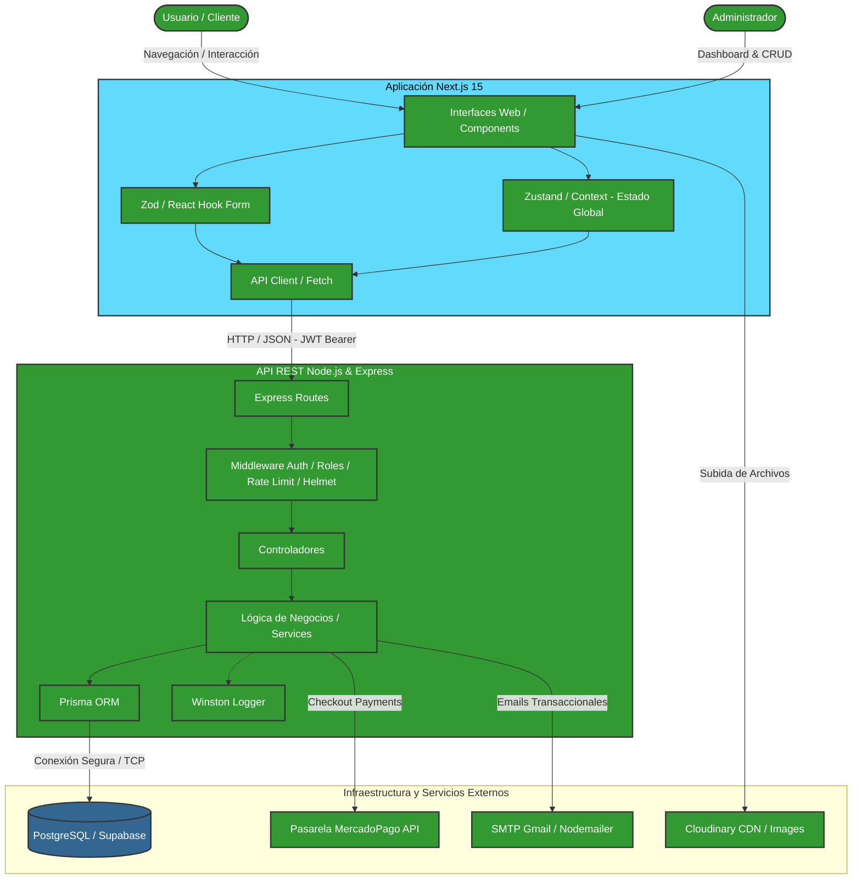

# Diagrama de Arquitectura de Sistemas 4Fun

El siguiente diagrama muestra el flujo de la aplicación "4Fun", desde la interacción humana en el cliente Next.js hasta el servicio persistente del backend Node.js, e interfaces con servicios externos.

