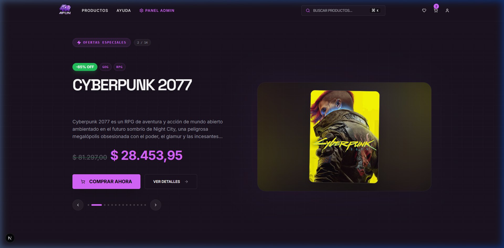
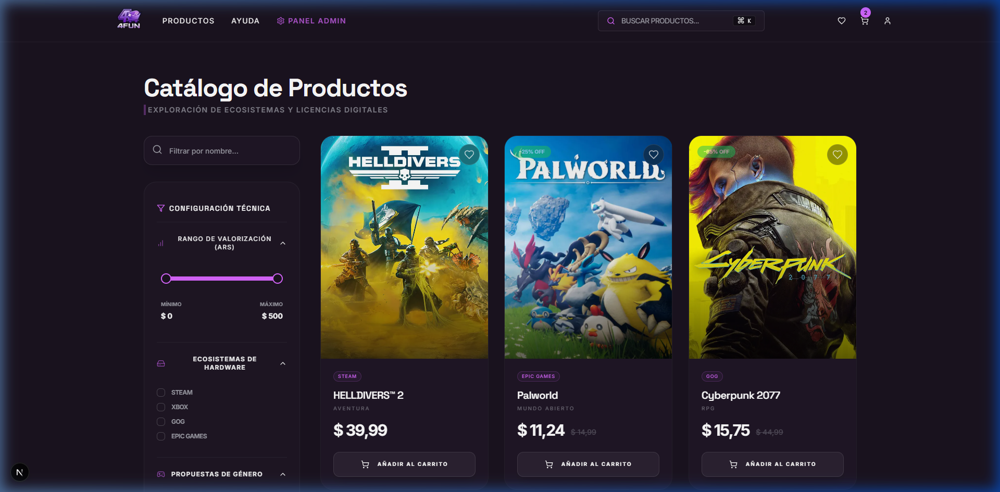
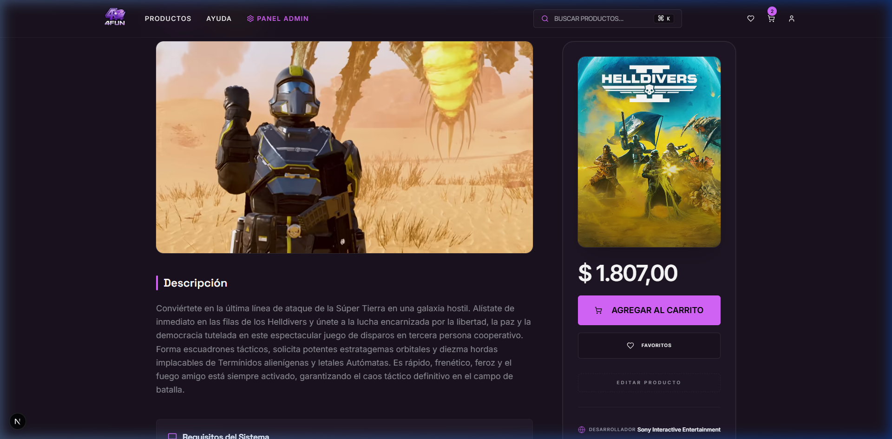
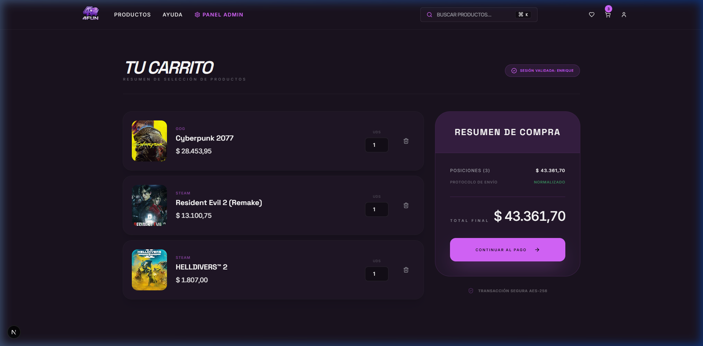
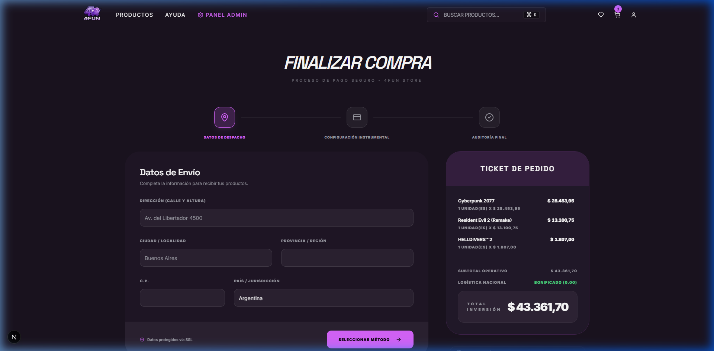
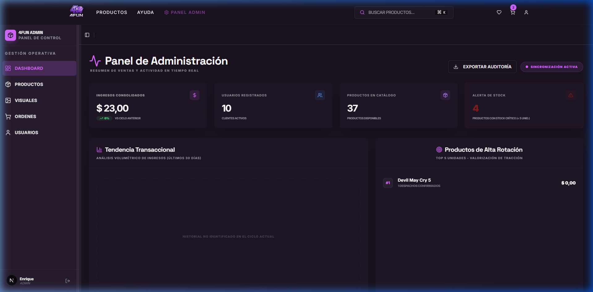
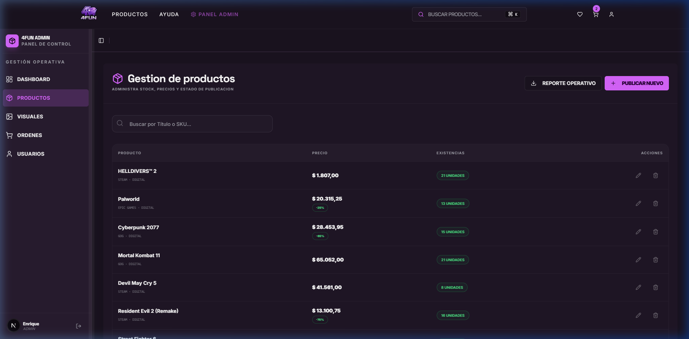

# Manual de Usuario: Sistema E-Commerce 4Fun Store

Este documento provee una guía visual paso a paso para el uso de la plataforma, cubriendo tanto la experiencia del cliente como las herramientas de administración.

---

## 1. Acceso y Navegación Principal
Al ingresar a la plataforma, el usuario es recibido por una interfaz moderna y reactiva que destaca las ofertas principales y el catálogo maestro.

---

## 2. Catálogo y Búsqueda
El sistema permite filtrar videojuegos por plataforma y género, además de contar con un motor de búsqueda indexada de alta velocidad.

---

## 3. Ficha Técnica de Producto
Cada título cuenta con una vista de detalle que especifica el género, plataforma, desarrollador y los requisitos mínimos/recomendados del sistema (Normalización 3NF).

---

## 4. Gestión de Carrito y Checkout
El usuario puede consolidar múltiples artículos. El sistema valida el stock en tiempo real antes de permitir el acceso a la pasarela de pago.

---

## 5. Panel de Control Administrativo (Dashboard)
Los perfiles con rol `admin` tienen acceso a métricas de ventas, stock crítico y órdenes pendientes de procesar.

---

## 6. Inventario y Auditoría
El administrador puede gestionar el ciclo de vida de los productos (Baja Lógica), actualizar stock y asignar claves digitales de forma masiva.

---

> [!NOTE] 
> **Integridad de Datos:** Todas las capturas reflejan el estado actual de la base de datos sincronizada con el backend.
